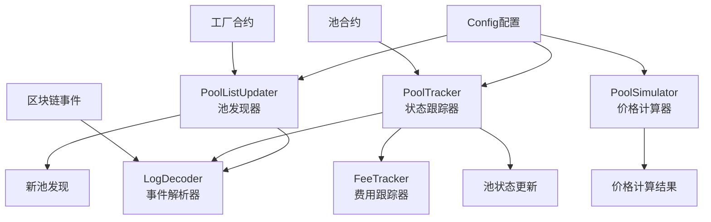

## UniswapV2包结构分析与聚合器使用指南

基于我对代码的深入分析，这个UniswapV2包是一个**完整的DEX流动性池管理系统**，可以为您的聚合器提供强大的能力。

## 📁 **核心架构分析**



## 🛠 **核心组件能力**

### 1. **PoolSimulator (价格计算引擎)**
```go
// 核心功能
- CalcAmountOut(): 计算交换输出金额
- CalcAmountIn(): 计算所需输入金额  
- CloneState(): 克隆池状态用于模拟
- UpdateBalance(): 更新池余额状态
- GetMetaInfo(): 获取池元信息
```

### 2. **PoolTracker (状态同步器)**
```go
// 实时监控能力
- 监听区块链事件更新池状态
- 解析Sync事件获取最新储备金
- 处理费用变化
- 维护池的实时状态
```

### 3. **PoolListUpdater (池发现器)**
```go
// 自动发现新池
- 扫描工厂合约发现新池
- 获取池的基本信息
- 支持增量更新
- 限制新池数量防止过载
```

### 4. **LogDecoder (事件解析器)**
```go
// 区块链事件处理
- 解析Sync事件获取储备金变化
- 识别最新的有效事件
- 提供结构化的数据输出
```

### 5. **FeeTracker (动态费用跟踪)**
```go
// 智能费用管理
- 支持动态费用查询
- 可配置费用获取策略
- 处理不同DEX的费用机制
```